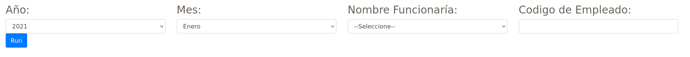
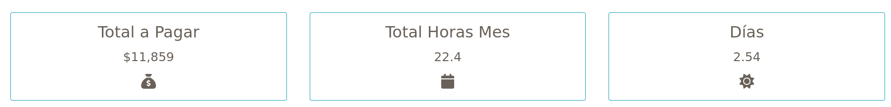
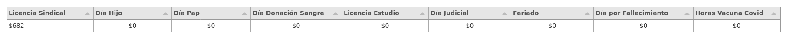
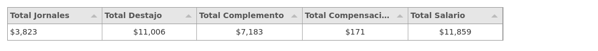
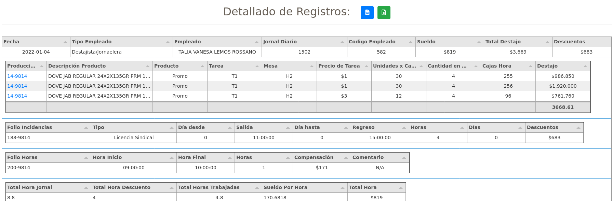

# Documentación de Reporte de Servicio

## Reportes

### Desempeñol Jornal [Rh](https://ms.linkaform.com/rh/desempeno_jornal.html)

#### Parametros de Filtrado

Parametros para pintar elementos de reporte.

|Parametro|Tipo|Descripcion|
|---|---|---|
|year|date|Año origen |
|month|date|Mes origen |
|select_user|select|Usuario Seleccionado |
|code|number|Codigo Empleado |





## Elementos del Reporte**


#### Tarjetas (First Element )


Estas tarjetas se encargaran de mosrar datos totales, como horas al mes trabajadas, días trabajardos y total a pagar por mes

|Nombre|Field|Descripcion|
|---|---|---|
|Total a pagar|total_pagar|Total a pagar|
|TOtal Horas mes|total_mes|TOtal a mes|
|Días|day|TOtal de días|


#### Licencias (Second Element )


Esta tabla se encargara de mostrar todos los registros totales de licencias tomadas por el usuario en ese Día

##### Tabla

|Nombre|Field|Descripcion|
|---|---|---|
|Licencia Sindical|sindical|PAgo de Licencia|
|Día Hijo|hijo|Licencia por hijo|
|Día Pap|pap|Licencia por  pap|
|Día Donación Sangre|donacion|Licencia por donación|
|Licencia Estudio|estudio|Licencia por estudio|
|Día Judicial|judicial|Licencia por judicial|
|Feriado|feriado|Licencia por feriado|
|Día por Fallecimiento|fallecimiento|Licencia por fallecimiento|
|Horas Vacuna Covid|covid|Licencia por covid|


EJEMPLO DE DECLARACIÓN DE COLUMNAS:

```js
var columsTable7 = [
  { title:"Licencia Sindical", field:'sindical', hozAlign:"left", width:200,formatter: "money",
    formatterParams: {symbol: "$", symbolAfter: "", decimal: ".", thousand: ",", precision: 0}},
  { title:"Día Hijo", field:'hijo', hozAlign:"center",width:180,formatter: "money",
    formatterParams: {symbol: "$", symbolAfter: "", decimal: ".", thousand: ",", precision: 0}},
  { title:"Día Pap" , field:'pap', hozAlign:"center", width:182,formatter: "money",
    formatterParams: {symbol: "$", symbolAfter: "", decimal: ".", thousand: ",", precision: 0} },
  { title:"Día Donación Sangre", field:'donacion', hozAlign:"center",width:210,formatter: "money",
    formatterParams: {symbol: "$", symbolAfter: "", decimal: ".", thousand: ",", precision: 0}},
  { title:"Licencia Estudio", field:'estudio', hozAlign:"center",width:200,formatter: "money",
    formatterParams: {symbol: "$", symbolAfter: "", decimal: ".", thousand: ",", precision: 0}},
  { title:"Día Judicial", field:'judicial', hozAlign:"center",width:190,formatter: "money",
  formatterParams: {symbol: "$", symbolAfter: "", decimal: ".", thousand: ",", precision: 0}},
  { title:"Feriado", field:'feriado', hozAlign:"center",width:190,formatter: "money",
  formatterParams: {symbol: "$", symbolAfter: "", decimal: ".", thousand: ",", precision: 0}},
  { title:"Día por Fallecimiento", field:'fallecimiento', hozAlign:"center",width:230,formatter: "money",
  formatterParams: {symbol: "$", symbolAfter: "", decimal: ".", thousand: ",", precision: 0}},
  { title:"Horas Vacuna Covid", field:'covid', hozAlign:"center",width:200,formatter: "money",
  formatterParams: {symbol: "$", symbolAfter: "", decimal: ".", thousand: ",", precision: 0}},
];
```
##### Ejemplo de data (Tablas normal)

```js
var dataTableLicencias = [
  {
    sindical: 682,
    hijo: 0,
    pap:  0,
    donacion: 0,
    estudio:  0,
    judicial: 0,
    feriado:  0,
    fallecimiento: 0,
    covid: 0,
  },
]
```


#### Tabla Totales (Third Element )


Esta tabla se encargara de mostrar todos los Totales

##### Tabla

|Nombre|Field|Descripcion|
|---|---|---|
|Total Jornales|total_jornales|Total de jornales|
|Total Destajo|total_destajo|Total destajo|
|Total  Complemento|total_complemento|Total complemento|
|Total Compensaciones|total_compensaciones|Total compensaciones|
|Total Salario|total_salario|Total salario|


EJEMPLO DE DECLARACIÓN DE COLUMNAS:

```js
var columsTable6 = [
  { title:"Total Jornales", field:'total_jornales', hozAlign:"left", width:170,formatter: "money",
    formatterParams: {symbol: "$", symbolAfter: "", decimal: ".", thousand: ",", precision: 0}},
  { title:"Total Destajo", field:'total_destajo', hozAlign:"center",width:170,formatter: "money",
    formatterParams: {symbol: "$", symbolAfter: "", decimal: ".", thousand: ",", precision: 0}},
  { title:"Total Complemento" , field:'total_complemento', hozAlign:"center", width:190,formatter: "money",
    formatterParams: {symbol: "$", symbolAfter: "", decimal: ".", thousand: ",", precision: 0} },
  { title:"Total Compensaciones", field:'total_compensaciones', hozAlign:"center",width:190,formatter: "money",
    formatterParams: {symbol: "$", symbolAfter: "", decimal: ".", thousand: ",", precision: 0}},
  { title:"Total Salario", field:'total_salario', hozAlign:"center",width:170,formatter: "money",
    formatterParams: {symbol: "$", symbolAfter: "", decimal: ".", thousand: ",", precision: 0}},
];
```

##### Ejemplo de data (Tablas normal)

```js
  var dataTableTotal = [
    {
      total_jornales: 3823,
      total_destajo: 11005.83,
      total_complemento: 7183,
      total_compensaciones: 171,
      total_salario: 11859,
    },
  ]

```


#### Detallado de Registros ( Fourth Element )



Este reporte tiene enbebidas 4 tablas, siendo la principal el encabezado y las secundarías desglosandose de esta.

##### Primera Tabla (Empleado)

|Nombre|Field|Descripcion|
|---|---|---|
|Fecha|fecha|Fecha del registro|
|Tipo Empleado|tipo_empleado|Tipo de empleado|
|Empleado|nombre_empleado|Nombre del empleado|
|Jornal Diario|jornal|Paga Diaría|
|Codigo Empleado|codigo|Codigo o Numero de empleado|
|Sueldo|sueldo|Sueldo a Empleado|
|Total Destajo|complemento|Valor Monetario por Destajo hecho|
|Descuentos|total_dia|Total del día|

EJEMPLO DE DECLARACIÓN DE COLUMNAS:

```js

var columsTable1 = [
  { title:"Fecha", field:'fecha',hozAlign:"center",width:200},
  { title:"Tipo Empleado", field:'tipo_empleado', hozAlign:"left", width:300},
  { title:"Empleado" , field:'nombre_empleado', hozAlign:"center", width:260, },
  { title:"Jornal Diario", field:'jornal', hozAlign:"center",width:250},
  { title:"Codigo Empleado", field:'codigo', hozAlign:"center",width:200},
  { title:"Sueldo", field:'sueldo',hozAlign:"center",width:200 ,formatter: "money",
    formatterParams: {symbol: "$", symbolAfter: "", decimal: ".", thousand: ",", precision: 0} },
  { title:"Total Destajo", field:'complemento',hozAlign:"center",width:200 ,formatter: "money",
    formatterParams: {symbol: "$", symbolAfter: "", decimal: ".", thousand: ",", precision: 0} },
  { title:"Descuentos", field:'total_dia',hozAlign:"center",width:200 ,formatter: "money",
    formatterParams: {symbol: "$", symbolAfter: "", decimal: ".", thousand: ",", precision: 0} },
];
```


##### Segunda Tabla (Producción)


|Nombre|Field|Descripcion|
|---|---|---|
|Producción|code|Link a documento de producción|
|Descripción Producto|descripcion_producto|Descripción de la producción|
|Producto|tipo_producto|Nombre del Producto|
|Tarea|tarea|Tarea realizada|
|Mesa|mesa|Tipo de mesa|
|Precio de Tarea|precio_tarea|Precio de tarea|
|Unidades x Caja|unidades_caja|Unidades por caja|
|Cantidad en Mesa|cantidad_mesa|Cantidad Mesa|
|Cajas Hora|cajas_hora|Caja Hora|
|Destajo|destajo|Destajo|

EJEMPLO DE DECLARACIÓN DE COLUMNAS:

```js
var columsTable2 = [
    { title:"Producción", field:'code', hozAlign:"left", formatter:"link", formatterParams:{url:"https://app.linkaform.com/#/records/detail/61d48f1a2aa40595b42c7d20"},width:120},
    { title:"Descripción Producto", field:'descripcion_producto', hozAlign:"left",width:310},
    { title:"Producto" , field:'tipo_producto', hozAlign:"center", width:160, },
    { title:"Tarea", field:'tarea', hozAlign:"center",width:160},
    { title:"Mesa", field:'mesa', hozAlign:"center",width:160},
    { title:"Precio de Tarea", field:'precio_tarea',hozAlign:"center",width:160, formatter: "money",
      formatterParams: {symbol: "$", symbolAfter: "", decimal: ".", thousand: ",", precision: 0}  },
    { title:"Unidades x Caja", field:'unidades_caja',hozAlign:"center",width:160},
    { title:"Cantidad en Mesa", field:'cantidad_mesa',hozAlign:"center",width:160},
    { title:"Cajas Hora", field:'cajas_hora',hozAlign:"center",width:160},
    { title:"Destajo", field:'destajo',hozAlign:"center",width:160 , formatter: "money",
      formatterParams: {symbol: "$", symbolAfter: "", decimal: ".", thousand: ",", precision: 3},bottomCalc:"sum", bottomCalcParams:{
      precision:2,}},
];

```


##### Cuarta Tabla (Horas)

|Nombre|Field|Descripcion|
|---|---|---|
|Folio Horas|folio_horas|Folio de documento|
|Hora Inicio|hora_inicio|Hora de inicio|
|Hora Final|hora_final|Hora Final|
|Horas|horas|Horas hechas|
|Compensación|compensacion|Compensación|
|Comentario|comentario|Comentario|


EJEMPLO DE DECLARACIÓN DE COLUMNAS:

```js
var columsTable4 = [
  { title:"Folio Horas", field:'folio_horas', hozAlign:"left", width:250},
  { title:"Hora Inicio" , field:'hora_inicio', hozAlign:"center", width:250, },
  { title:"Hora Final", field:'hora_final', hozAlign:"center",width:170},
  { title:"Horas", field:'horas', hozAlign:"center",width:170},
  { title:"Compensación", field:'compensacion', hozAlign:"center",width:170,formatter: "money",
    formatterParams: {symbol: "$", symbolAfter: "", decimal: ".", thousand: ",", precision: 0}},
  { title:"Comentario", field:'comentario', hozAlign:"center",width:170},
];
```
##### Quinta Tabla (Totales)

|Nombre|Field|Descripcion|
|---|---|---|
|Total Hora Jornal|total_jornal|Total jornal|
|Total Hora Descuento|total_descuento|Total hora de descuento|
|Total Horas Trabajadas|total_trabajado|Total de horas trabajadas|
|Sueldo Por Hora|total_sueldo|Sueldo por hora|
|Total Hora|total_hora|Total hora|


EJEMPLO DE DECLARACIÓN DE COLUMNAS:

```js
var columsTable5 = [
  { title:"Total Hora Jornal", field:'total_jornal', hozAlign:"left", width:250},
  { title:"Total Hora Descuento", field:'total_descuento', hozAlign:"left", width:250},
  { title:"Total Horas Trabajadas" , field:'total_trabajado', hozAlign:"center", width:250, },
  { title:"Sueldo Por Hora", field:'total_sueldo', hozAlign:"left", width:250},
  { title:"Total Hora", field:'total_hora', hozAlign:"center",width:170,formatter: "money",
    formatterParams: {symbol: "$", symbolAfter: "", decimal: ".", thousand: ",", precision: 0}},
];
```

##### Ejemplo de data (Tablas enbebidas)

```js
  var dataTableTest = [
    {
      tipo_empleado: "Destajista/Jornaelera",
      nombre_empleado: "TALIA VANESA LEMOS ROSSANO",
      jornal: "1502",
      codigo: "582",
      sueldo: 819,
      complemento: 3668.61,
      total_dia: 683,
      fecha: "2022-01-04",
      arrayProduction:[
        {
          code : '14-9814',
          descripcion_producto: "DOVE JAB REGULAR 24X2X135GR PRM 10% DESC",
          tipo_producto: "Promo",
          tarea: "T1",
          mesa: "H2",
          cantidad_mesa: 4,
          precio_tarea: 0.516,
          unidades_caja: 30,
          cajas_hora: 255,
          destajo: 986.85,
        },
        {
          code : '14-9814',
          descripcion_producto: "DOVE JAB REGULAR 24X2X135GR PRM 10% DESC",
          tipo_producto: "Promo",
          tarea: "T1",
          mesa: "H2",
          cantidad_mesa:4,
          precio_tarea: 1,
          unidades_caja: 30,
          cajas_hora: 256,
          destajo: 1920,
        },
        {
          code : '14-9814',
          descripcion_producto: "DOVE JAB REGULAR 24X2X135GR PRM 10% DESC",
          tipo_producto: "Promo",
          tarea: "T1",
          mesa: "H2",
          cantidad_mesa: 4,
          precio_tarea: 2.645,
          unidades_caja: 12,
          cajas_hora: 96,
          destajo: 761.76,
        },
      ],
      arrayIncidencias:[
        {
          folio: "188-9814",
          tipo_licencia: "Licencia Sindical",
          dia_desde: 0,
          salida: "11:00:00",
          dia_hasta: 0,
          regreso: "15:00:00",
          horas: 4,
          descuento: 682.7272727272726,
          dias:0
        },
      ],
      arrayHoras:[
        {
          folio_horas: "200-9814",
          hora_inicio: "09:00:00",
          hora_final: "10:00:00",
          horas: 1,
          compensacion: 170.68,
          comentario: "N/A"
        },
      ],
      arrayHorasTotales:[
        {
          total_jornal: 8.8,
          total_descuento: 4,
          total_trabajado: 4.8,
          total_sueldo: 170.6818,
          total_hora: 819.27,
        },
      ]
    },
    {
      tipo_empleado: "Destajista/Jornaelera",
      nombre_empleado: "TALIA VANESA LEMOS ROSSANO",
      jornal: "1502",
      codigo: "582",
      sueldo: 1502,
      complemento: 2166.61,
      total_dia: 3668.61,
      fecha: "2022-01-05",
      arrayProduction:[
        {
          code : '14-9814',
          descripcion_producto: "DOVE JAB REGULAR 24X2X135GR PRM 10% DESC",
          tipo_producto: "Promo",
          tarea: "T1",
          mesa: "H2",
          cantidad_mesa: 4,
          precio_tarea: 0.516,
          unidades_caja: 30,
          cajas_hora: 255,
          destajo: 986.85,
        },
        {
          code : '14-9814',
          descripcion_producto: "DOVE JAB REGULAR 24X2X135GR PRM 10% DESC",
          tipo_producto: "Promo",
          tarea: "T1",
          mesa: "H2",
          cantidad_mesa:4,
          precio_tarea: 1,
          unidades_caja: 30,
          cajas_hora: 256,
          destajo: 1920,
        },
        {
          code : '14-9814',
          descripcion_producto: "DOVE JAB REGULAR 24X2X135GR PRM 10% DESC",
          tipo_producto: "Promo",
          tarea: "T1",
          mesa: "H2",
          cantidad_mesa: 4,
          precio_tarea: 2.645,
          unidades_caja: 12,
          cajas_hora: 96,
          destajo: 761.76,
        },
      ],
      arrayIncidencias:[

      ],
      arrayHoras:[
      ]
    },
    {
      tipo_empleado: "Destajista/Jornaelera",
      nombre_empleado: "TALIA VANESA LEMOS ROSSANO",
      jornal: "1502",
      codigo: "582",
      sueldo: 1502,
      complemento: 2166.61,
      total_dia: 3668.61,
      fecha: "2022-01-05",
      arrayProduction:[
        {
          code : '14-9814',
          descripcion_producto: "DOVE JAB REGULAR 24X2X135GR PRM 10% DESC",
          tipo_producto: "Promo",
          tarea: "T1",
          mesa: "H2",
          cantidad_mesa: 4,
          precio_tarea: 0.516,
          unidades_caja: 30,
          cajas_hora: 255,
          destajo: 986.85,
        },
        {
          code : '14-9814',
          descripcion_producto: "DOVE JAB REGULAR 24X2X135GR PRM 10% DESC",
          tipo_producto: "Promo",
          tarea: "T1",
          mesa: "H2",
          cantidad_mesa:4,
          precio_tarea: 1,
          unidades_caja: 30,
          cajas_hora: 256,
          destajo: 1920,
        },
        {
          code : '14-9814',
          descripcion_producto: "DOVE JAB REGULAR 24X2X135GR PRM 10% DESC",
          tipo_producto: "Promo",
          tarea: "T1",
          mesa: "H2",
          cantidad_mesa: 4,
          precio_tarea: 2.645,
          unidades_caja: 12,
          cajas_hora: 96,
          destajo: 761.76,
        },
      ],
      arrayIncidencias:[
      ],
      arrayHoras:[
      ],
    },
  ]
```
