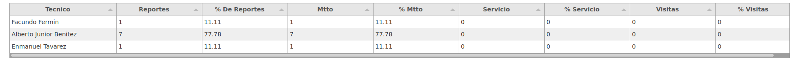

# Documentación de Reporte de Servicio

## Reportes

### KPI Tecnicos RD [kpi_tecnicos_rd](https://ms.linkaform.com/servicos/kpi_tecncios_rd.html)

#### Parametros de Filtrado

Parametros para pintar elementos de reporte.

|Parametro|Tipo|Descripcion|
|---|---|---|
|firstElement|json|Definie los datos % De reportes realizados |

#### Elementos del Reporte**
##### % De reportes realizados ( First Element )

|Nombre|Field|Descripcion|
|---|---|---|
|Tecnico|responsable|Nombre del Tecnico|
|Reportes|reportes|Cantidad de Reportes|
|% De Reportes|percentage_total|% de Reportes con respecto a los demas tecncios|
|Mtto|mantenimiento|Cantidad de Reportes de Manteneimiento|
|% Mtto|percentage_mtto|% de Reportes de Manteniento del técnico|
|Servicio|servicio|Cantidad de Reporte de Servicio del técncio|
|% Servicio|percentage_servicio|Porcentaje de Reporte de Servicio del técncio|
|Visitas|visita|Cantidad de Visitas a cliente del técncio|
|% Visitas|percentage_visita|% de Vistias a cliente del técncio|
